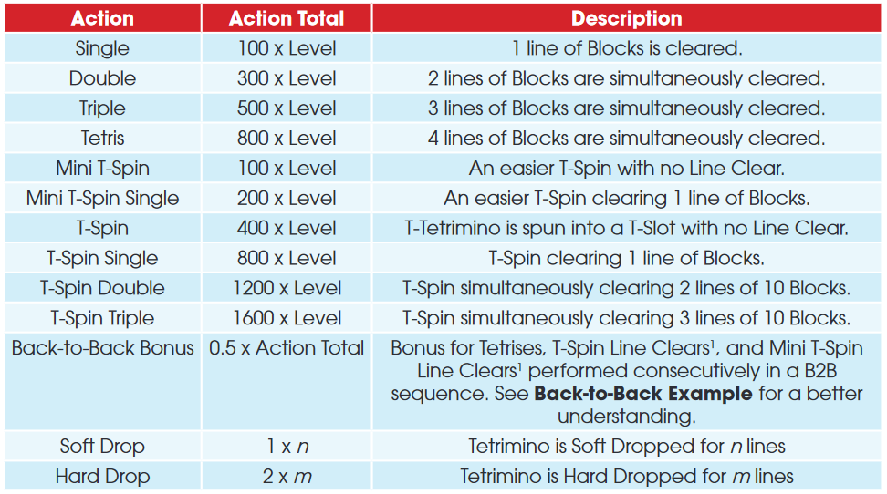

# ICS Tetris

A tetris clone.

## Running the game

Run the run.bat file, this will compile the source code to a new `build` directory and run it.

## Controls

| Key   | Action                   |
| ----- | ------------------------ |
| Up    | Rotate clockwise         |
| Z     | Rotate counter-clockwise |
| A     | Rotate 180 degrees       |
| LEFT  | Move left                |
| RIGHT | Move right               |
| DOWN  | Move down (soft drop)    |
| SPACE | Hard drop                |

## Game Play

Stack tetriminos, once a row has been completely filled, it is cleared. Certain methods of clearing rows, such as clearing multiple at once, will give bonus score (for details, see the [scoring section](#scoring)).

The next five pieces in the queue are shown on the left, with the first at the top.

Pieces can be held for use later using the C key, the held piece will be displayed on the left.

## Levels

The game advances to a new level every ten lines. The level can increase indefinitely.

The speed at which the tetrimino falls increases with the level, it is calculated using the formula:

time per line = (0.8 - ((level - 1) * 0.007))(level-1)

## Scoring

Scoring is done as suggested in the 2009 Tetris Design Guideline, with the exception that Mini T-Spins are not implemented.

